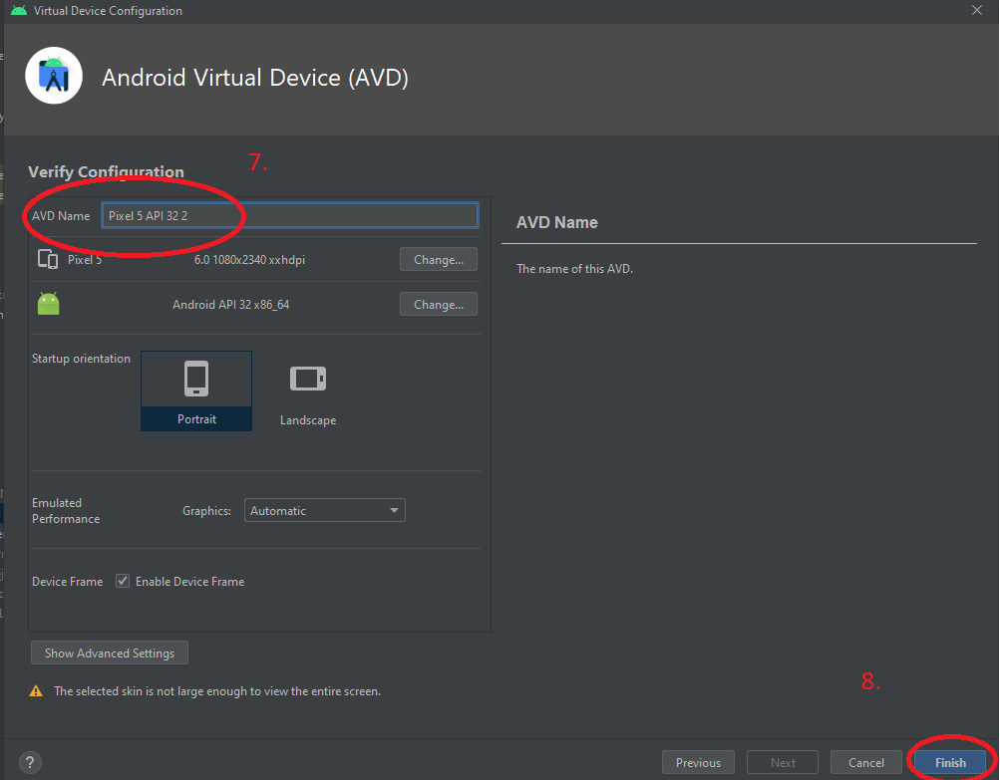
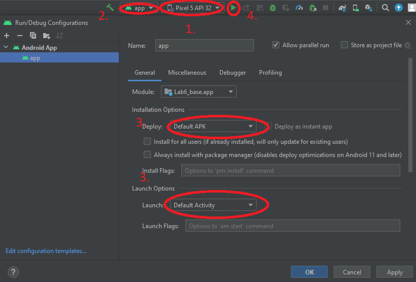

# Noteboard :scroll:

## Content

[What is Noteboard?](#what-is-noteboard)

[Testing the app with Android Studio](#testing-with-android-studio)

## What is Noteboard?

Have you ever wanted a way to collaborate with coworkers online in an extremely simple way?

Do you find that using complex software for simple communication is pointless? 

Noteboard is here to fix all those issues.

Noteboard offers an extremely simple UI in 3 languages ( 🇪🇪, 🇷🇺, 🇬🇧 ) and 2 easy on the eye layouts (night layout, day layout) in the form of a bulletin board/noteboard to help you communicate with coworkers, friends or anyone else.

[Back to content](#content)

## Testing with Android Studio

### Creating a virtual device

First of all, after opening android studio we need to create a virtual device. If you already have a virtual device with an API level of over 28 set up, click [here](#running-the-application-on-a-virtual-device)

1. Click on device manager.

2. Click on create device.

3. Select a phone. In the example Pixel 5 is being used.

4. Press next.

5. Select any release with an API level of 28 or higher.

6. Press next.

7. Name the device anything you'd like.

8. Click finish.

Voilà! You now have a virtual device ready to run applications!

### Running the application on a virtual device

1. After opening the project, select the virtual device you would like to run the application on. Make sure that the API level of said device is over 28.

2. Make sure the run configuration is set to launch the application. This should be done by default, but it won't hurt to make sure.

2. Click on "app", edit run configuration and make sure that the launch option is set to "Default Activity" and the deploy option is set to "Default APK"

3. Press the "RUN" button or Shift+F10 to boot up the virtual device and launch the application.

[Back to content](#content)